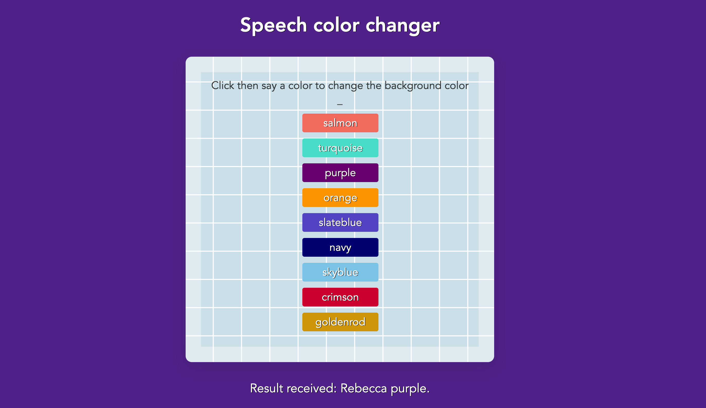

# Speech Recognition Application

Simple speech recognition application using the Web Speech API. 
Overview of what it does:
 1. It initializes the Web Speech API components (SpeechRecognition, SpeechGrammarList, and SpeechRecognitionEvent).
 2.  It sets up the speech recognition instance with specific configurations such as language, grammar, and result handling.
 3.  It dynamically generates a list of colors and displays them as hints on the webpage.
 4.  It starts the speech recognition process when the user clicks anywhere on the body of the document.
 5.  It processes the recognized speech to change the background color of the webpage based on the spoken color.


## Installation

1. Clone the repository:
   ```bash
   git clone https://github.com/tpreisig/speech-recognition.git
   ```
2. Navigate to the project directory:
   ```bash
   cd speech-recognition
   ```
3. Run application:
   ```bash
   open ./index.html
   ```

## License

This project is licensed under the MIT License - see the [LICENSE](LICENSE) file for details.

## Screenshots



## Contact

Maintained by tpreisig - feel free to reach out!
