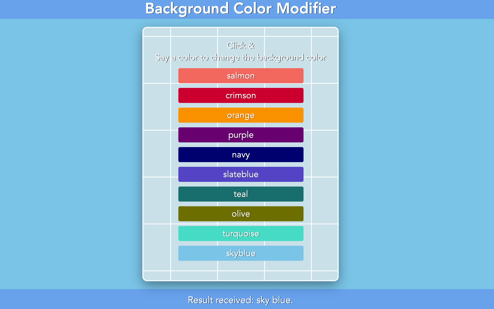

# Speech Recognition Application

### Web Speech API

Overview of what it does:
 1. Initializing the Web Speech API components (SpeechRecognition, SpeechGrammarList, and SpeechRecognitionEvent).
 2. Setting up the speech recognition instance with specific configurations such as language, grammar, and result handling.
 3. Generating a list of colors and displays them as hints on the webpage.
 4. Starting the speech recognition process when the user clicks anywhere on the body of the document.
 5. Processing the recognized speech to change the background color accordingly.
   
**Note:** The Web Speech API is experimental and primarily supported in Chrome. It requires microphone access, which the browser will prompt for.

## Application

## Features
- Voice-activated background color changes.
- Custom grammar for better color recognition accuracy (requires defining `grammar`).
- Displays recognized text in the result section.

## Usage
- Open the page in your browser.
- Click anywhere on the page body to start speech recognition.
- Speak a color name (e.g., "red").
- The background color will change to the recognized color, and diagnostic info will appear in the #output element.
- The recognition stops automatically after speech ends.

## License

This project is licensed under the MUGL License - see the [LICENSE](LICENSE) file for details.

## Contact

Maintained by tpreisig - feel free to reach out!
